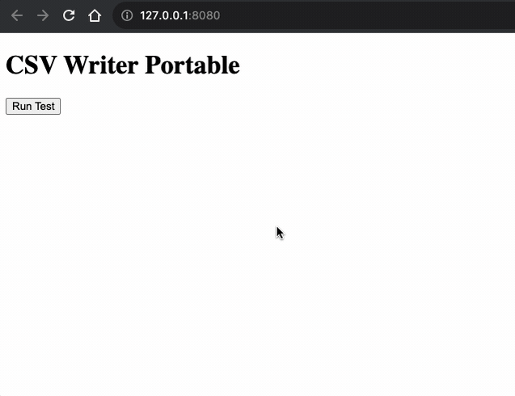

## CSV Writer Portable


### Index
- [CSV Writer Portable](#csv-writer-portable)
  - [Index](#index)
  - [Introduction](#introduction)
  - [Rationale](#rationale)
  - [Features](#features)
  - [Prerequisites](#prerequisites)
  - [Webpack](#webpack)
  - [How to Test](#how-to-test)
  - [Quick Start](#quick-start)
    - [Writing Records as Array of Objects to a File](#writing-records-as-array-of-objects-to-a-file)
    - [Using Custom Filter Functions](#using-custom-filter-functions)
    - [Multiple Writes to the Same File](#multiple-writes-to-the-same-file)
    - [Writing Large Data Sets](#writing-large-data-sets)
    - [Skipping Header Line](#skipping-header-line)
  - [API Documentation](#api-documentation)
    - [createObjectCsvWriter(params)](#createobjectcsvwriterparams)
    - [createArrayCsvWriter(params)](#createarraycsvwriterparams)
    - [createObjectCsvStringifier(params)](#createobjectcsvstringifierparams)
    - [CsvWriter.writeRecords(records)](#csvwriterwriterecordsrecords)
- [Contribute](#contribute)
  - [Guidelines](#guidelines)
- [Development Setup](#development-setup)
  - [Requirements](#requirements)
- [License](#license)


### Introduction

This repository serves as an enhanced version of an existing project, [ryu1kn/csv-writer](https://github.com/ryu1kn/csv-writer).

### Rationale

The original project appeared to be unmaintained, leaving issues such as TypeScript compilation errors unresolved.

---

### Features

This library enables the conversion of JavaScript objects and arrays to CSV strings or writes them directly to a file. The generated CSV complies with [RFC 4180](https://tools.ietf.org/html/rfc4180).

### Prerequisites

- Node.js (Version 16 or higher)

### Webpack

Creating browser-compatible JavaScript files is now possible, thanks to the included Webpack configurations.

Here's what you can do with the available NPM scripts:

- `bundle:dev`: It bundles the code and includes source maps.
- `bundle:prod`: This is for production.
- `compile`: Compiles TypeScript based on tsconfig.json.
- `compile-and-bundle`: Compile and bundle sources in one go.
- `serve`: Starts a basic HTTP server to show files from the `./public` directory at `http://localhost:8080`.

### How to Test

1. To bundle and serve the application, run the following commands in sequence:

   ```bash
   npm run bundle:dev
   npm run serve
   ```
    Then, navigate to http://localhost:8080.

    

2. To compile TypeScript and bundle in one go:

    ```bash
    npm run compile-and-bundle
    npm run serve
    ```

### Quick Start

#### Writing Records as Array of Objects to a File

The following code snippet demonstrates how to write records, defined as an array of objects, to a file.

```ts
import { createObjectCsvWriter } from 'csv-writer-portable';

const csvWriter = createObjectCsvWriter({
    path: 'path/to/file.csv',
    header: [
        {id: 'name', title: 'NAME'},
        {id: 'lang', title: 'LANGUAGE'}
    ]
});

const records = [
    {name: 'Bob',  lang: 'French, English'},
    {name: 'Mary', lang: 'English'}
];

csvWriter.writeRecords(records) // returns a promise
    .then(() => {
        console.log('...Done');
    });
```

The generated CSV file will contain the following:

```csv
NAME,LANGUAGE
Bob,"French, English"
Mary,English
```

#### Using Custom Filter Functions

You can pass custom filter functions to manipulate field strings. Here’s an example that removes non-printable characters like `\r` and `\n`:

```ts
import { createObjectCsvWriter } from 'csv-writer-portable';

const csvPath = 'test.csv';
const csvWriter = createObjectCsvWriter({
  path: csvPath,
  header: [
    { id: 'phone_number', title: 'phone_number' },
    { id: 'name', title: 'name' }
  ],
  filterFunction: (value: any) => {
    const str = String(value);
    // a simple regex to remove \r and \n chars
    return str.replace(/[\r\n]/g, '');
  },
  alwaysQuote: true
});

const data = [
  { phone_number: 9978789799, name: "John \nDoe\r" },
  { phone_number: 8898988989, name: "Bob Marlin" }
];

async function writeCsv() {
  await csvWriter.writeRecords(data);
}

writeCsv().catch(err => console.error('Error writing CSV:', err));
```

#### Multiple Writes to the Same File

To append more records, simply call `writeRecords` again after the promise from the previous call is fulfilled.

```ts
// Usage in an async function
await csvWriter.writeRecords(records1);
await csvWriter.writeRecords(records2);
```

#### Writing Large Data Sets

For large data sets, you may want to create a Node.js transform stream and use `CsvStringifier`. This enables you to pipe the stream to a file write stream.

#### Skipping Header Line

To omit the header line, provide only the field IDs without titles.

```ts
const csvWriter = createCsvWriter({
    path: 'path/to/file.csv',
    header: ['name', 'lang']
});
```

If each record is defined as an array, use `createArrayCsvWriter` to get a `csvWriter` instance.

```ts
import { createArrayCsvWriter } from 'csv-writer-portable';

const csvWriter = createArrayCsvWriter({
    header: ['NAME', 'LANGUAGE'],
    path: 'path/to/file.csv'
});

const records = [
    ['Bob',  'French, English'],
    ['Mary', 'English']
];

csvWriter.writeRecords(records) // returns a promise
    .then(() => {
        console.log('...Done');
    });
```

This will produce a file path/to/file.csv with following contents:

```csv
NAME,LANGUAGE
Bob,"French, English"
Mary,English
```

If you just want to get a CSV string but don't want to write into a file, you can use `createObjectCsvStringifier` (or `createArrayCsvStringifier`) to get a `csvStringifier`.

```ts
import { createObjectCsvStringifier } from 'csv-writer-portable';

const csvStringifier = createObjectCsvStringifier({
    header: [
        {id: 'name', title: 'NAME'},
        {id: 'lang', title: 'LANGUAGE'}
    ]
});

const records = [
    {name: 'Bob',  lang: 'French, English'},
    {name: 'Mary', lang: 'English'}
];
```

```ts
console.log(csvStringifier.getHeaderString());
// => 'NAME,LANGUAGE\n'

console.log(csvStringifier.stringifyRecords(records));
// => 'Bob,"French, English"\nMary,English\n'
```

### API Documentation

The following tables describe the methods exposed by the CSV Writer Portable library.

#### createObjectCsvWriter(params)

| Description | Link |
| --- | --- |
| Creates a CsvWriter instance | [Source Code](https://github.com/brakmic/csv-writer-portable/blob/main/src/lib/csv-writer-factory.ts#L40) |

| Parameter | Type | Description | Default | Allowed |
| --- | --- | --- | --- | --- |
| params | Object | Configuration options | - |
| └─ path | String | File path | - |
| └─ header | Array<{id, title}\|string> | Header specification | - |
| └─ fieldDelimiter | String (Optional) | Field delimiter | `,` | `; \| \t` |  
| └─ recordDelimiter | String (Optional) | Record delimiter | `\n` |
| └─ encoding | String (Optional) | File encoding | `utf8` |
| └─ append | Boolean (Optional) | Append mode | `false` |
| └─ alwaysQuote | Boolean (Optional) | Always quote field values | `false` |
| └─ quoteEmptyFields | Boolean (Optional) | Double-quote ("") fields with empty values | `false` |
| └─ filterFunction | Function (Optional) | Custom function to manipulate field strings | (value: any) => value |
| └─ useBom | Boolean (Optional) | Add BOM for UTF-8 encoding | `false` |

**Returns**: [CsvWriter](https://github.com/brakmic/csv-writer-portable/blob/main/src/lib/csv-writer.ts#L10) instance

---

#### createArrayCsvWriter(params)

| Description | Link |
| --- | --- |
| Creates an ArrayCsvWriter instance | [Source Code](https://github.com/brakmic/csv-writer-portable/blob/main/src/lib/csv-writer-factory.ts#L

56) |

| Parameter | Type | Description | Default | Allowed |
| --- | --- | --- | --- | --- |
| params | Object | Configuration options | - |
| └─ path | String | File path | - |
| └─ header | Array<string> | Header specification | - |
| └─ fieldDelimiter | String (Optional) | Field delimiter | `,` | `; \| \t` |  
| └─ recordDelimiter | String (Optional) | Record delimiter | `\n` |
| └─ encoding | String (Optional) | File encoding | `utf8` |
| └─ append | Boolean (Optional) | Append mode | `false` |
| └─ alwaysQuote | Boolean (Optional) | Always quote field values | `false` |
| └─ quoteEmptyFields | Boolean (Optional) | Double-quote ("") fields with empty values | `false` |
| └─ filterFunction | Function (Optional) | Custom function to manipulate field strings | (value: any) => value |
| └─ useBom | Boolean (Optional) | Add BOM for UTF-8 encoding | `false` |

**Returns**: [CsvWriter](https://github.com/brakmic/csv-writer-portable/blob/main/src/lib/csv-writer.ts#L10) instance

---

#### createObjectCsvStringifier(params)

| Description | Link |
| --- | --- |
| Creates an ObjectCsvStringifier instance | [Source Code](https://github.com/brakmic/csv-writer-portable/blob/main/src/lib/csv-stringifier-factory.ts#L28) |

| Parameter | Type | Description | Default | Allowed |
| --- | --- | --- | --- | --- |
| params | Object | Configuration options | - |
| └─ header | Array<{id, title}\|string> | Header specification | - |
| └─ fieldDelimiter | String (Optional) | Field delimiter | `,` | `; \| \t` |
| └─ recordDelimiter | String (Optional) | Record delimiter | `\n` |
| └─ headerIdDelimiter | String (Optional) | Header ID delimiter | `_` |
| └─ alwaysQuote | Boolean (Optional) | Always quote field values | `false` |
| └─ quoteEmptyFields | Boolean (Optional) | Double-quote ("") fields with empty values | `false` |
| └─ filterFunction | Function (Optional) | Custom function to manipulate field strings | (value: any) => value |

**Returns**: [ObjectCsvStringifier](https://github.com/brakmic/csv-writer-portable/blob/main/src/lib/csv-stringifiers/object.ts#L6) instance

---

#### CsvWriter.writeRecords(records)

| Description | Link |
| --- | --- |
| Writes records to CSV | [Source Code](https://github.com/brakmic/csv-writer-portable/blob/main/src/lib/csv-writer.ts#L24) |

| Parameter | Type | Description |
| --- | --- | --- |
| records | Iterable | Collection of objects or arrays |

**Returns**: Promise<void>


## Contribute

If you'd like to contribute by either proposing new features or reporting bugs, please visit: [GitHub Issues](https://github.com/brakmic/csv-writer-portable/issues)

### Guidelines

- **Feature Requests**: Context is key. Please provide a detailed explanation of why you need the specific feature and how it could benefit the users.
  
- **Bug Reports**: Reproducible code snippets are greatly appreciated.

## Development Setup

### Requirements

- Node.js (Version 16 or higher)
- Docker

## License

Licensed under the [MIT License](./LICENSE).
```
